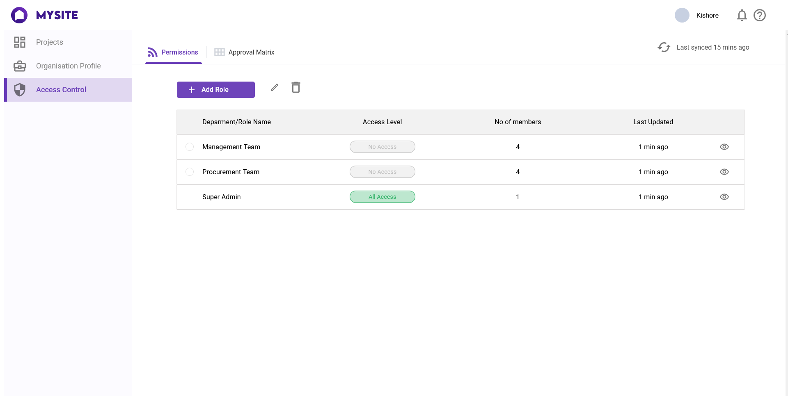
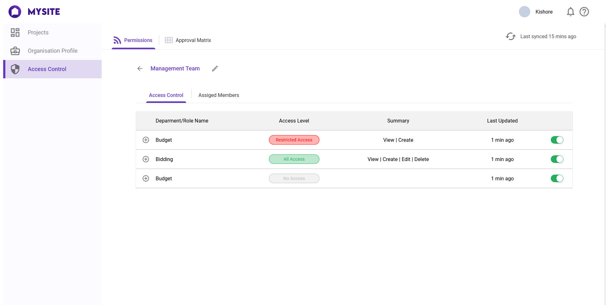
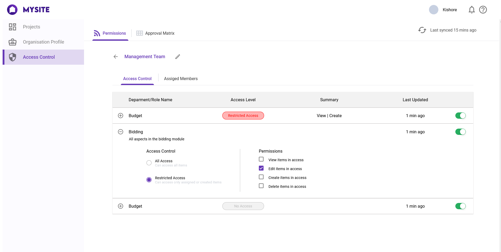

# This is a sample of Single page application made by ReactJS

Data is hardcoded as state of app.jsx but can use api too.  
Heroku link : https://mysitereactjs.herokuapp.com/

## Functionality

Can go inside any department of role.  
can come back.  
Can expand the department inside the department of role.  
Can change any permission.  
Can use shrtcut "All Access" to give access to all and "Restricted Access" to remove all access.  
Can turn on or off any department of department inside role.  

## Screenshots

 
 
 
 
 
